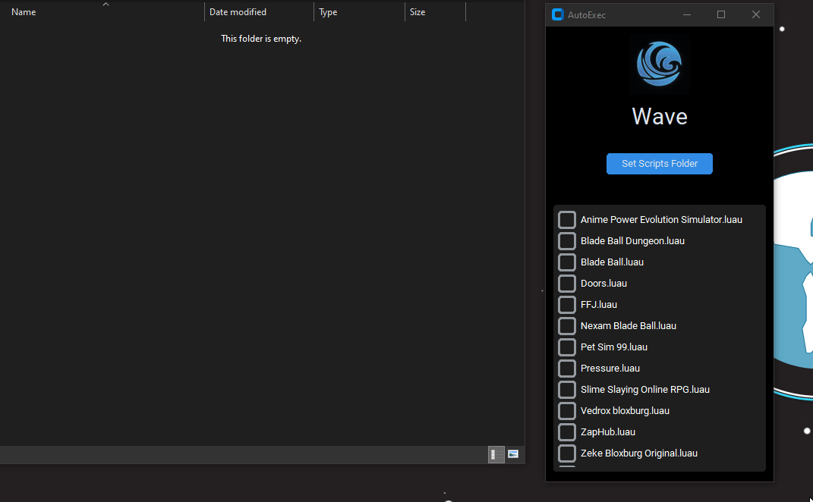

# AutoExec Manager

  

A simple utility to manage script execution across multiple Roblox executors.

## Supported Executors

- **Wave** - Default script location: `%LOCALAPPDATA%\Wave\autoexec`
- **Zenith** - Default script location: `%APPDATA%\Zenith\AutoExec`
- **AWP** - Default script location: `%LOCALAPPDATA%\ui\autoexec`

## Usage

1. Click on the logo to switch between executors
2. Use "Set Scripts Folder" to customize your scripts directory
3. Check/uncheck scripts to add or remove them from the autoexec folder
